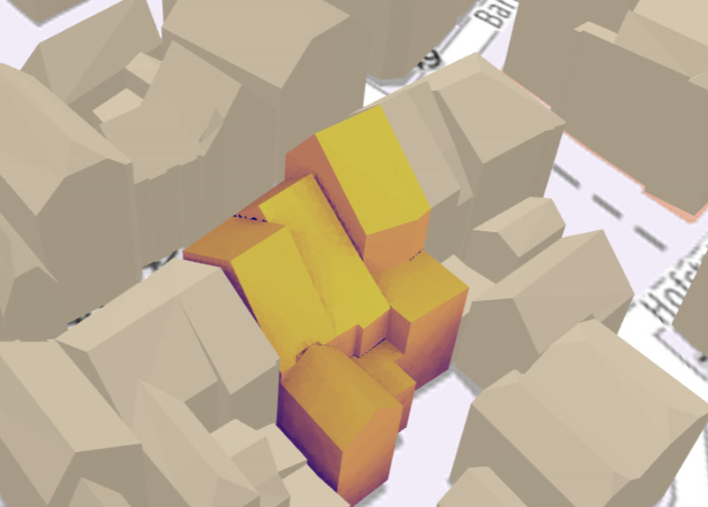

# Getting Started

> 💡 A minimal example App using 'simshady' can be found [here](https://github.com/open-pv/minimalApp).

## Installation

Install the package using your preferred package manager:

```bash
npm install @openpv/simshady
```

## Basic Usage

1. **Initialize the Scene**

Begin by creating a new [`ShadingScene`](/docs/classes/index.ShadingScene.html) instance:

```javascript
import ShadingScene from '@openpv/simshady';

const scene = new ShadingScene();
```

2. **Add Geometries**

Add one or more simulation geometries — such as buildings or PV panels — using [`addSimulationGeometry`](/docs/classes/index.ShadingScene.html#addsimulationgeometry).  
Add shading geometries using [`addShadingGeometry`](/docs/classes/index.ShadingScene.html#addshadinggeometry):

```javascript
scene.addShadingGeometry(someShadingGeometry);
scene.addSimulationGeometry(someSimulationGeometry);
```

In Figure 1, the difference between the two types of geometries is shown. The simulation geometry, represented by the colored building, is the main focus where PV yield is calculated. The shading geometries, shown in grey-brown, are included in the simulation to account for shading effects due to their close proximity.



_Figure 1: Screenshot from openpv.de showing both simulation geometries (colored) and shading geometries (grey-brown)._

3. **Add Solar Irradiance Data**

Include irradiance data in the [required format](/docs/types/utils.SolarIrradianceData.html) via [`addSolarIrradiance`](/docs/classes/index.ShadingScene.html#addsolarirradiance). This data should contain time series for both direct and diffuse irradiance:

```javascript
scene.addSolarIrradiance(someSolarIrradianceData);
```

4. **Run the Simulation**

Call the [`calculate`](/docs/classes/index.ShadingScene.html#calculate) method to perform the simulation. It returns a [Three.js Mesh](https://threejs.org/docs/#api/en/objects/Mesh), which can be used directly in a Three.js scene:

```javascript
let mesh = await scene.calculate({
  solarToElectricityConversionEfficiency: 0.15,
});

showThreeJS(mesh);
```

> 💡 You can see a real-world usage example at [openpv.de](https://openpv.de).
