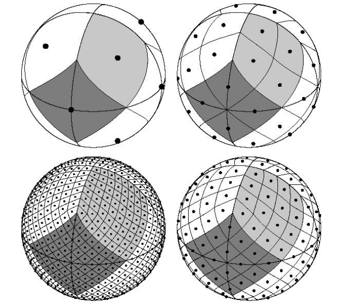

# How Simshady Works

Simshady models the yield of photovoltaic (PV) systems by considering two primary factors: **weather/climate data** and **shading from local 3D geometry**.

## 3D Scene Setup

PV system output is heavily influenced by shading from nearby objects—such as buildings, vegetation, or terrain. Simshady represents this environment through a [`ShadingScene`](/docs/classes/index.ShadingScene.html), which is composed of `three.js` geometries.

- Use `addMainGeometry()` to define the primary object for simulation (e.g., PV panels or the target building).
- Use `addShadingGeometry()` to add surrounding objects that may cast shadows (e.g., neighboring buildings, trees).

## Weather, Climate, and Skydomes

Simshady uses time-series data of Global Horizontal Irradiance (GHI) and Direct Normal Irradiance (DNI) from [NREL](https://nsrdb.nrel.gov/) for locations in Germany. These datasets do not include directional irradiance information, so Simshady reconstructs it using the [HEALPix](https://doi.org/10.1086/427976) framework, which divides the sky dome into 96 equal-area segments.



_Figure 1: Sky discretization using HEALPix, from Gorski et al._

For each time step:

- DNI is assigned to the sky segment corresponding to the sun's position.
- The diffuse component (GHI - DNI) is distributed equally across all sky segments, weighted by the sine of the solar altitude angle.

The resulting irradiance on a flat surface is:

```
Irradiance = DNI × sin(altitude) + Σ(Diffuse_segment × sin(altitude))
```

## Why Skydomes?

There are two key reasons for using skydomes:

1. They enable simultaneous simulation of direct and diffuse solar radiation.
2. They allow for time-resolved PV yield simulation.

The process works as follows:

1. For each sky segment and each triangle of the simulation geometry, Simshady uses the Möller-Trumbore algorithm to check if the line of sight is obstructed by any shading geometry. The result is:

   - `0` if an intersection occurs.
   - The dot product between the triangle normal and the vector to the sky segment if unshaded.

   This produces a shading mask of shape `S x N`, where `S` is the number of sky segments and `N` is the number of triangles. Each value is between 0 and 1.

2. Radiance values from the sky dome are integrated over time. If irradiance data is provided as a time series with shape `S x T` (S = sky segments, T = time steps), the energy received by triangle `n` at time `t` is:

```
E(t, n) = 1 / (2 × π) × Σ(Mask(s, n) × irrad(s, t))
```

The result `E(t, n)` is the irradiance in Wh/m².

## GPU-Accelerated Simulation

Since the computation for each triangle is independent, the simulation is fully parallelizable. The Möller-Trumbore intersection algorithm is implemented in WebGL to leverage GPU acceleration, enabling efficient real-time simulation of shading and solar irradiance.
