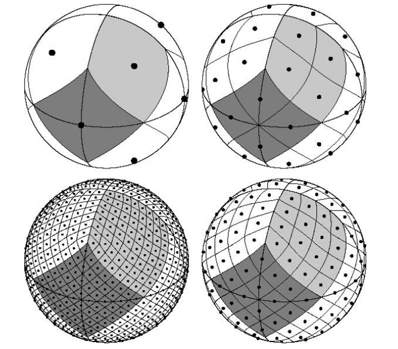
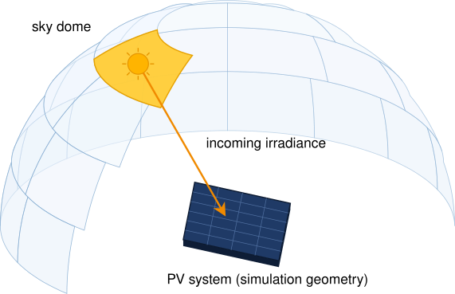

# How Simshady Works

Simshady models the yield of photovoltaic (PV) systems by considering two primary factors: **weather/climate data** and **shading from local 3D geometry**.

## 3D Scene Setup

PV system output is heavily influenced by shading from nearby objects—such as buildings, vegetation, or terrain. Simshady represents this environment through a [`ShadingScene`](/simshady/classes/index.ShadingScene.html), which is composed of `three.js` geometries.

- Use `addSimulationGeometry()` to define the primary object for simulation (e.g., PV panels or the target building).
- Use `addShadingGeometry()` to add surrounding objects that may cast shadows (e.g., neighboring buildings, trees).

## Weather, Climate, and Skydomes

Simshady uses time-series data of Global Horizontal Irradiance (GHI) and Direct Normal Irradiance (DNI) from [NREL](https://nsrdb.nrel.gov/) for locations in Germany. These datasets do not include directional irradiance information, so Simshady reconstructs it using the [HEALPix](https://doi.org/10.1086/427976) framework, which divides the sky dome into 96 equal-area segments.



_Figure 1: Sky discretization using HEALPix, from Gorski et al._

For each time step:

- DNI is assigned to the sky segment corresponding to the sun's position.
- The diffuse component (GHI - DNI) is distributed equally across all sky segments, weighted by the sine of the solar altitude angle.

The resulting irradiance on a flat surface is:

```
Irradiance = DNI × sin(altitude) + Σ(Diffuse_segment × sin(altitude))
```

## Simulation Flow

The central `ShadingScene` class orchestrates the simulation through the following steps:

1. **Geometry pre-processing:** First, the simulation mesh is refined by recursively subdividing triangles whose longest edge exceeds a configurable threshold (default 1.0 m), ensuring a uniform spatial resolution for the PV yield calculation. Reducing this threshold results in a larger number of smaller triangles in the mesh, and therefore a higher resolution of the simulated shading. To improve the simulation speed, a geometry filter removes shading triangles that cannot cast shadows on the simulation geometry given the minimum solar altitude angle present in the irradiance dataset.

2. **Ray tracing:** The simulation utilizes the Möller-Trumbore intersection algorithm to determine if any shading objects obstruct the view between a sky segment and the main simulation geometry (See Figure 2). For each triangle in the simulation geometry, a shading mask is generated, indicating whether an object blocks the incident irradiance beam from the sky dome surface to the triangle. The shading mask values range from 0 to 1, where 0 indicates that an object shades the triangle, 1 signifies that there is no obstruction and the line of sight is perpendicular to the triangle, and values between 0 and 1 represent cases where there is no obstruction but the angle of incidence is not perpendicular.

3. **Irradiance integration and yield calculation:** The irradiance values from all sky segments are needed as input data. They represent the irradiance in W/m² that reaches the simulation geometry from a given sky segment. They are multiplied by their corresponding shading mask values and summed to obtain the total irradiance received by each triangle. The resulting intensities are converted to electrical yield (in kWh/m²) using a configurable solar-to-electricity conversion efficiency (default 15%). This efficiency includes the PV panel efficiency as well as the ratio of total area and area covered by PV panels.

4. **Visualization:** The computed yield values are normalized and mapped to RGB colors using a configurable colormap. The resulting mesh carries both the color attribute for visualization and per-triangle solar yield for further analysis.

<p align="center">
  
  <br>
  <em>Figure 2: Schema of the simulation setup: For each surface of the sky dome and for each triangle of the simulation geometry, it is simulated if an object blocks the incoming irradiance.</em>
</p>

## Why Skydomes?

There are two key reasons for using skydomes:

1. They enable simultaneous simulation of direct and diffuse solar radiation.
2. They allow for time-resolved PV yield simulation.

The process works as follows:

1. For each sky segment and each triangle of the simulation geometry, Simshady uses the [Möller-Trumbore algorithm](https://doi.org/10.1080%2F10867651.1997.10487468) to check if the line of sight is obstructed by any shading geometry. The result is:
   - `0` if an intersection occurs.
   - The dot product between the triangle normal and the vector to the sky segment if unshaded.

   This produces a shading mask of shape `S x N`, where `S` is the number of sky segments and `N` is the number of triangles. Each value is between 0 and 1.

2. Radiance values from the sky dome are integrated over time. If irradiance data is provided as a time series with shape `S x T` (S = sky segments, T = time steps), the energy received by triangle `n` at time `t` is:

```
E(t, n) = 1 / (2 × π) × Σ(Mask(s, n) × irrad(s, t))
```

The result `E(t, n)` is the irradiance in Wh/m².

## GPU-Accelerated Simulation

Since the computation for each triangle is independent, the simulation is fully parallelizable. The Möller-Trumbore intersection algorithm is implemented in WebGL to leverage GPU acceleration, enabling efficient real-time simulation of shading and solar irradiance.
