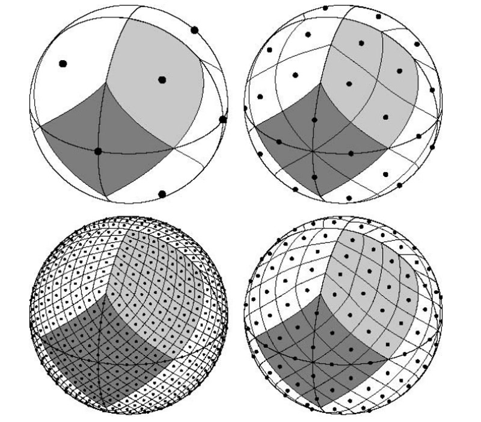
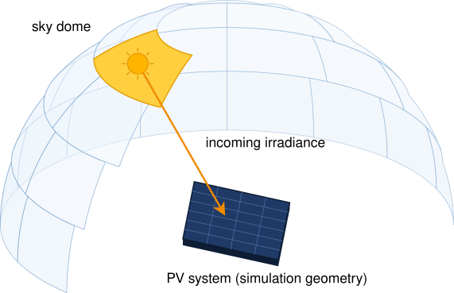

# How Simshady Works

Simshady models the yield of photovoltaic (PV) systems by considering two primary factors: **weather/climate data** and **shading from local 3D geometry**.

## 3D Scene Setup

PV system output is heavily influenced by shading from nearby objects—such as buildings, vegetation, or terrain. Simshady represents this environment through a [`ShadingScene`](/simshady/classes/index.ShadingScene.html), which is composed of `three.js` geometries.

- Use `addSimulationGeometry()` to define the primary object for simulation (e.g., PV panels or the target building).
- Use `addShadingGeometry()` to add surrounding objects that may cast shadows (e.g., neighboring buildings, trees).

## Weather, Climate, and Skydomes

Simshady uses time-series data of Global Horizontal Irradiance (GHI) and Direct Normal Irradiance (DNI) from [NREL](https://nsrdb.nrel.gov/) for locations in Germany. These datasets do not include directional irradiance information, so Simshady reconstructs it using the [HEALPix](https://doi.org/10.1086/427976) framework, which divides the sky dome into 96 equal-area segments.



_Figure 1: Sky discretization using HEALPix, from Gorski et al._

The value stored for each sky segment is a radiance in W/m²/sr. For each time step:

- DNI is assigned to the sky segment corresponding to the sun's position.
- The diffuse component (DHI = GHI − DNI × sin(altitude<sub>sun</sub>)) is distributed equally across all sky segments.

The irradiance received by a surface is obtained by integrating the radiance of all sky segments over the sky dome. Since all HEALPix segments have the same solid angle Ω, this becomes:

```
Irradiance = Ω × Σ_s ( L_s × cos(θ_s) )
```

with `L_s` the radiance of sky segment `s`, `θ_s` the angle of incidence between the surface normal and the direction of segment `s`, and `Ω` the solid angle covered by a single sky segment, which is the same for every segment in an equal-area discretization like HEALPix.

## Simulation Flow

The central `ShadingScene` class orchestrates the simulation through the following steps:

1. **Geometry pre-processing:** First, the simulation mesh is refined by recursively subdividing triangles whose longest edge exceeds a configurable threshold (default 1.0 m), ensuring a uniform spatial resolution for the PV yield calculation. Reducing this threshold results in a larger number of smaller triangles in the mesh, and therefore a higher resolution of the simulated shading. To improve the simulation speed, a geometry filter removes shading triangles that cannot cast shadows on the simulation geometry given the minimum solar altitude angle present in the irradiance dataset.

2. **Ray tracing:** The simulation utilizes the [Möller-Trumbore intersection algorithm](https://doi.org/10.1080%2F10867651.1997.10487468) to determine if any shading objects obstruct the view between a sky segment and the main simulation geometry (See Figure 2). For each triangle in the simulation geometry, a shading mask is generated, indicating whether an object blocks the incident irradiance beam from the sky dome surface to the triangle. The shading mask values are binary, where 0 indicates that an object shades the triangle and 1 that there is no obstruction.

3. **Irradiance integration and yield calculation:** The radiance values of all sky segments are needed as input data. They represent the radiance in W/m²/sr that reaches the simulation geometry from a given sky segment. Each radiance is multiplied by its corresponding shading mask, by the cosine of the angle of incidence, and by the solid angle of a sky segment. The products are then summed over all segments to obtain the irradiance received by each triangle. The resulting intensities are converted to electrical yield (in kWh/m²) using a configurable solar-to-electricity conversion efficiency (default 15%). This efficiency includes the PV panel efficiency as well as the ratio of total area and area covered by PV panels.

4. **Visualization:** The computed yield values are normalized and mapped to RGB colors using a configurable colormap. The resulting mesh carries both the color attribute for visualization and per-triangle solar yield for further analysis.

<p align="center">
  
  <br>
  <em>Figure 2: Schema of the simulation setup: For each surface of the sky dome and for each triangle of the simulation geometry, it is simulated if an object blocks the incoming irradiance.</em>
</p>

### Why Sky domes?

There are two reasons for using skydomes:

1. They enable simultaneous simulation of direct and diffuse solar radiation.
2. They allow for time-resolved PV yield simulation.

The process works as follows:

1. For each sky segment and each triangle of the simulation geometry, Simshady uses the [Möller-Trumbore algorithm](https://doi.org/10.1080%2F10867651.1997.10487468) to check if the line of sight is obstructed by any shading geometry. The result is:
   - `0` if an intersection occurs.
   - `1` if the sky segment is visible from the triangle.

   This produces a binary shading mask of shape `S x N`, where `S` is the number of sky segments and `N` is the number of triangles.

2. Radiance values from the sky dome are integrated over the sky dome. If radiance data is provided as a time series with shape `S x T` (S = sky segments, T = time steps), the irradiance received by triangle `n` at time `t` is:

```
E(t, n) = Ω × Σ(Mask(s, n) × cos(θ(s, n)) × L(s, t))       with Ω the solid angle per sky segment
```

where `θ(s, n)` is the angle of incidence between the normal of triangle `n` and the direction of sky segment `s`.

The result `E(t, n)` is the irradiance in W/m² that can be absorbed by the n-th triangle of the simulation geometry. Multiplied by the number of hours the time step covers, it gives the absorbed energy in Wh/m², and multiplied with a solar-to-electricity conversion efficiency, it gives the electricity yield of the n-th triangle at time interval t.

## GPU-Accelerated Simulation

Since the computation for each triangle is independent, the simulation is fully parallelizable. The Möller-Trumbore intersection algorithm is implemented in WebGL to leverage GPU acceleration, enabling efficient real-time simulation of shading and solar irradiance.
