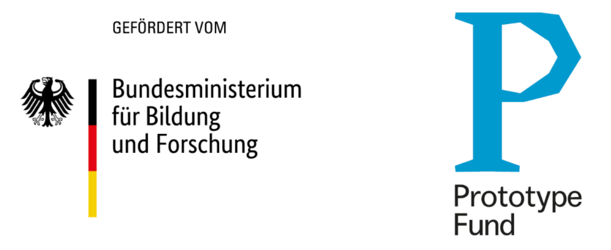

# Summary

openpv/simshady is a JavaScript package for simulating photovoltaic (PV) energy yields. It integrates local climate data and 3D objects into its shading simulation, utilizing Three.js meshes for geometric modeling. The package performs shading analysis using a WebGL-parallelized implementation of the Möller-Trumbore intersection algorithm @Möller01011997], producing color-coded Three.js meshes that represent the expected PV yield.

# Statement of need

To meet global climate targets, solar photovoltaic (PV) capacity must expand significantly. Tripling renewable energy capacity by 2030 is essential to limit global warming to 1.5°C [@IEA2023]. The expansion of PV plays a crucial role, and PV systems offer an additional benefit: small-scale house-mounted PV systems enable public participation and legitimize the energy transition.

For calculating the yield of PV systems, various factors are important, including the location of the planned installation, local climate, surrounding objects such as houses or trees, and terrain. To provide accurate estimates of expected yields, simulation tools are essential in both research and practical PV system planning.

For these reasons, a variety of software tools for simulating photovoltaic systems already exist [@holmgren2018review; @jakica2018state]. One widely used software is the Python package pvlib [@anderson2023pvlib], which offers a range of functionalities. However, the rather niche topic of shading simulation with 3D objects is not included in this package. Another Python-based software that enables irradiance modeling in two dimensions is pvfactors [@pvfactors2025; @anoma_view_2017].

Web-based tools for solar panel simulations, such as PVGIS, PVWatts, and RETScreen, provide an accessible means for non-technical individuals to estimate energy yields based on geographic location and building geometry [@psomopoulos2015comparative]. However, these tools lack the capability to perform shading simulations using 3D geometries.

# Package description

`openpv/simshady` simulates the yield of photovoltaic (PV) systems by considering weather/climate data and shading from local 3D geometry. The model represents the environment through a 3D scene setup, comprising primary objects for simulation (e.g., PV panels or target buildings) and surrounding objects that may cast shadows (e.g., neighboring buildings, trees). Weather and climate data are integrated using Global Horizontal Irradiance (GHI) and Direct Normal Irradiance (DNI) datasets, which are reconstructed to include directional irradiance information using the HEALPix framework [@Górski_2005; @zonca2019healpy].

The simulation utilizes the Möller-Trumbore intersection algorithm [@Möller01011997] to determine if any shading objects obstruct the view between a sky pixel and the main simulation geometry. For each triangle in the simulation geometry, a shading mask is generated, indicating whether an object blocks the line of sight from the sky pixel to the triangle. The shading mask values range from 0 to 1, where 0 indicates that an object shades the triangle, 1 signifies that there is no obstruction and the line of sight is perpendicular to the triangle, and values between 0 and 1 represent cases where there is no obstruction but the angle of incidence is not perpendicular. The aggregated radiance values from all sky dome pixels are then multiplied by the corresponding shading mask values and summed to calculate the total energy received by each triangle. This computation is fully parallelizable and has been implemented using WebGL, allowing for GPU acceleration.

# Conclusion

The `openpv/simshady` package serves two primary purposes: it provides a solution for scientific calculations of PV yield, while also facilitating science communication through interactive and user-friendly simulations that can be run directly within a web browser. This eliminates the need for specialized software or programming knowledge, making it accessible to a broader range of users. Furthermore, by implementing the main algorithm in WebGL, the package achieves higher performance than a pure Javascript implementation, and it offers a JavaScript wrapper around PV simulation in WebGL. This is particularly beneficial because WebGL is a language that is not widely known among scientists, and thus can be challenging for them to implement their own code, making the `openpv/simshady` package a valuable tool for simplifying this process.

# Credit Authorship Statement

FK: Conceptualization, Software, Funding acquisition, Writing – original draft

MG: Conceptualization, Software, Funding acquisition, Writing – review & editing

KH: Conceptualization, Software, Funding acquisition, Writing – review & editing

KP: Conceptualization, Software, Funding acquisition, Writing – review & editing

# Acknowledgements

The development of this software was funded by the German Federal Ministry of Research, Technology and Space within the Prototype fund project.

{ width=30% }

# References

